# FED3 Viz Manual

	

**Written for version**: v0.2.0 (beta)

**Date of creation**: May 21th, 2020

**GitHub**: [https://github.com/earnestt1234/FED3_Viz](https://github.com/earnestt1234/FED3_Viz)

### Welcome!

Welcome to FED3 Viz, a Python GUI for graphing data from FED3 devices.  This manual will describe the basic functionalities of FED3 Viz and how to use them.  It will also try to address any common confusions/errors that may pop up.

You can find the FED3 Viz landing page at [GitHub](https://github.com/earnestt1234/FED3_Viz); all changes to the program will be made and logged though GitHub.  I wrote this application while working as a research technician in the Kravitz Lab (with input from Dr. Kravitz and the rest of the lab!).

If you do notice any inaccuracies, typos, misinformation, or missed content in this manual, please report the issue through GitHub.  You can also find this manual as a PDF under `FED3_Viz/pdfs`.  Please note that some screenshots may refer to earlier software versions, so some images may not match exactly what you see.

Thanks!

Tom Earnest ([@earnestt1234](https://github.com/earnestt1234))

### Installation

On the FED3 Viz GitHub, there is an [Installation.md](https://github.com/earnestt1234/FED3_Viz/blob/master/Installation.md) markdown file which contains instructions on how to run FED3 Viz via either a) running the Python script or b) running a bundled application (from Windows or Mac).  This manual will only cover the use of the application once installed.

 

# Table of Contents

- [Tour](#tour)

  - [Home Tab](#home-tab)
  - [Plots Tab](#plots-tab)
  - [Settings Tab](#settings-tab)
  - [About Tab](#about-tab)
- [Loading Data](#loading-data)

  - [Loading FEDs](#loading-feds)
    - [How FEDs Are Loaded](#how-feds-are-loaded)
    - [Loading Errors](#loading-errors)
  - [File View](#file-view)
  - [Deleting FEDs](#deleting-feds)
- [Groups](#groups)
  
  - [Creating Groups](#creating-groups)
  - [Editing Groups](#editing-groups)
  - [Deleting Groups](#deleting-groups)
- [Saving Groups](#saving-groups)
- [Plots](#plots)
  
  - [Single Pellet Plot](#single-pellet-plot)
  - [Multi Pellet Plot](#multi-pellet-plot)
  - [Average Pellet Plot](#average-pellet-plot)
  - [Interpellet Interval Plot](#interpellet-interval-plot)
  - [Group Interpellet Interval Plot](#group-interpellet-interval-plot)
  - [Single Poke Plot](#single-poke-plot)
  - [Average Poke Plot](#average-poke-plot)
  - [Poke Bias Plot](#poke-bias-plot)
  - [Average Poke Bias Plot](#average-poke-bias-plot)
  - [Breakpoint Plot](#breakpoint-plot)
  - [Group Breakpoint Plot](#group-breakpoint-plot)
  - [Day/Night Plot](#daynight-plot)
  - [Chronogram (Line)](#chronogram-line)
  - [Chronogram (Heatmap)](#chronogram-heatmap)
  - [Diagnostic Plot](#diagnostic-plot)
- [Managing Plots](#managing-plots)
  
  - [Renaming Plots](#renaming-plots)
  - [New Window](#new-window)
  - [Navigation Toolbar](#navigation-toolbar)
  - [Saving Plots](#saving-plots)
    - [Saving Images](#saving-images)
    - [Saving Data](#saving-data)
    - [Saving Code](#saving-code)
  - [Deleting Plots](#deleting-plots)
- [Settings](#settings)

  - [Saving Settings](#saving-settings)
  - [Default Settings](#default-settings)
  - [Last Used Settings](#last-used-settings)
- [FAQ](#faq)
- [Appendix](#appendix)
- [Averaging Methods Diagram](#averaging-methods-diagram)
  - [Plot Column Dependencies](#plot-column-dependencies)

 

# Tour

This section will introduce the layout of FED3 Viz, and define some areas of the application.  FED3 Viz has four different panes, which can be selected by clicking the following tabs at the top of the application window.

- **Home Tab**
- **Plots Tab**
- **Settings Tab**
- **About Tab**

### Home Tab

The **Home Tab** is the tab that is open when FED3 Viz starts up.  On this tab, you can load FED3 data and create plots from them.

	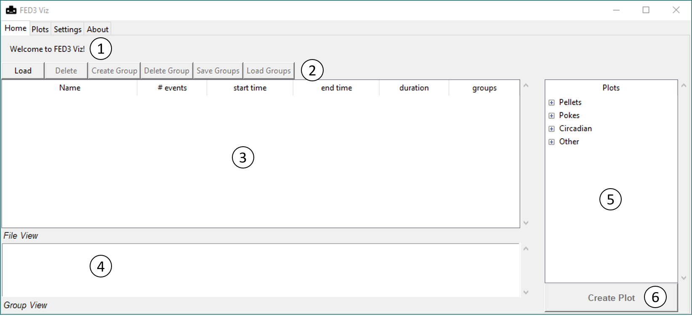

Elements of the Home Tab:

1. The **Info Bar** shows helpful text for the Home Tab.  Hover over a button or select a plot to show a brief description.  A progress bar will also display here when loading FED data.
2. The top row of buttons, which are tools for loading and managing data files within FED3 Viz.
3. The **File View** is the largest element of the Home Tab.  When a FED data file is loaded, it will appear as a row in the File View.  Each column will show data associated with that data file.
4. The **Group View** lists all the currently loaded Groups, used for combining data from multiple FEDs (see the Groups section below).
5. The **Plot Selector** pane, where you can choose which plots to make for the loaded devices.
6. The **Create Plot Button**, which creates a plot based on the loaded device files and the selection in the Plot Selector.  Whether or not this button is active depends on what data have been loaded into the application; for example, most plotting buttons must have some files selected in order to be active.

### Plots Tab

The **Plots Tab** is used for selecting, viewing, and editing the plots that have been created.  

	

The Plots Tab is made up of three elements (from left to right):

- A column of buttons for working with plots
- A **Plot List** showing all the currently loaded plots
- A **Display Pane** which renders the plots.  At the bottom of the Display Pane, there is a a **Navigation Toolbar** (included from [`matplotlib`](https://matplotlib.org/3.1.1/users/navigation_toolbar.html)) used for editing the view of the plot on display.

### Settings Tab

The **Settings Tab** offers controls for creating plots and preferences for the way FED3 Viz runs.

	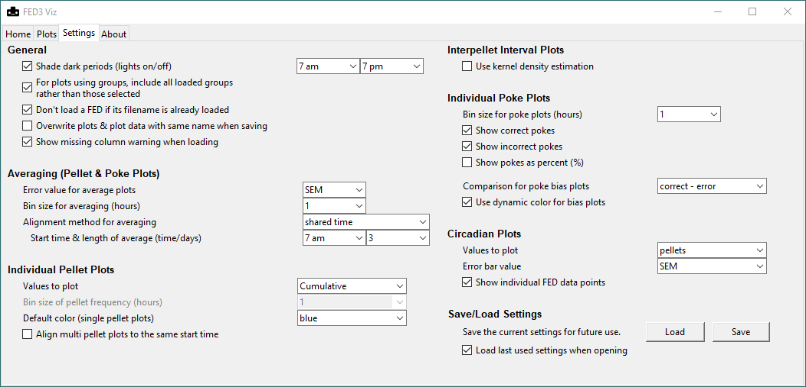

The Settings Tab is divided into different headered sections, corresponding to options for different plots.  It starts with a **General** section (options for that affect the whole application or multiple plot types), and ends with a **Save/Load Settings** section (for preserving desired settings for future use).

### About Tab

The **About Tab** shows the version number and date of FED3 Viz, as well as some FED3-related links.

	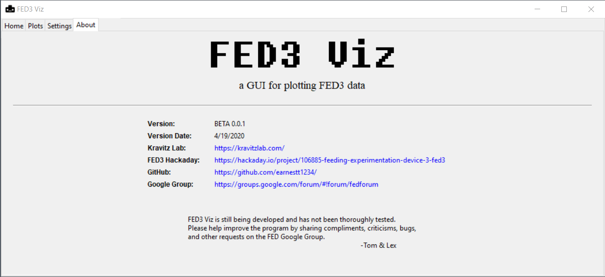

 

# Loading Data

FED3 saves data as a `.csv` file on its internal SD card; these are the files used by FED3 Viz.  You can access these files by ejecting the SD card and connecting it to your computer (**not** by connecting the FED to the computer via the micro-USB).  They have the following naming structure:

*FED{FED #}\_{DATE}\_{RECORDING #}.csv*

- FED # = 3 digit device number
- Date = 6 digit date (month-day-year format)
- Recording # = 2 digit recording number

FED3 Viz will recognize these `.csv` files, as well as files converted into Excel (`.xlsx`) format.  If the data have been changed out of one of these file types, they will have to be reconverted in order to be used by FED3 Viz.

The [Appendix](#appendix) contains a note about different versions of the Arduino scripts used by FED3, and how FED3 Viz deals with them.

### Loading FEDs

The **Load Button** and the **Load Folder Button** of the Home Tab are used for loading data into FED3 Viz; these buttons are always active.  The Load Button will allow you to select individual files to load, while the Load Folder Button will allow you to selected a folder to load files from.  Note that the Load Folder Button will currently search for *all files* in *all subfolders* of the selected folder; searching an extensive tree (like your User directory) will likely cause the program to crash.

When folders are being loaded, a progress bar will appear in the Info Bar.  To halt the loading process, either press the **Abort Load Button** or press Escape.

##### How FEDs Are Loaded

FED3 Viz will attempt to load every file `.csv` or `.xlsx` file selected by the Load Button file dialogue using a Python library for working with tabular data (`pandas`).  The loading process first tries to parse the file to find columns matching the standard FED3 data columns (as of the time of writing this manual).

*Standard FED3 Data Columns:*

- MM:DD:YYYY hh:mm:ss
- Device_Name
- Battery_Voltage
- Motor_Turns
- Session_Type
- Event
- Active_Poke
- Left_Poke
- Right_Poke
- Pellet_Count
- Retrieval_Time

These columns are looked for **by name, not the content or type of data in the column**.  If all correctly found, these columns will be used to try and generate additional variables used for plotting (elapsed time, pellets as a binary entries, etc.).  By default, files with the same name will not be reloaded (even if they reside in different folders); to load duplicate file names, untick **Settings > General > Don't load a FED if it's filename is already loaded**. 

##### Loading Errors

An error message pop-up may be raised if there are any issues encountered during the loading process.  The two major types of errors are:

- Unrecognized: the file(s) was not recognized as FED3 data.  This error means that the program failed to load the data.  This can occur from attempts to read non `.csv` or `.xlsx` files, or from correct file types that differ significantly from the standard FED3 file format.  This error can not be suppressed.
- Missing Data: the file(s) is missing at least one of the default columns.  This means that the file was loaded, but it may be missing some columns which are used by FED3 Viz for plotting; it is meant to serve as a warning that some plots may be unavailable or may produce unexpected results.  This error can occur when the raw data has been edited to remove or rename columns, or when using an earlier version of FED3 Arduino code (see the [Appendix](#appendix) for a discussion).  This error can be suppressed by unticking **Settings > General > Show missing column warning when loading.**

Further discussion of problems with loading may be brought up in the [FAQ](#FAQ) as the application develops.  Additionally, the dependent columns of each plot can be viewed in the Appendix.

### File View

	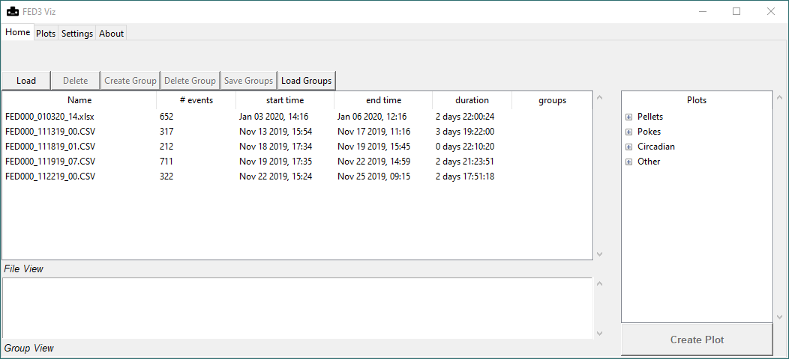

Loaded FED data can be inspected on the File View of the Home Tab.  Each loaded FED will correspond to a row in the File View, where column entries will correspond to properties of the file:

- Name: the name & extension of the file
- Mode: the recording mode of the file (e.g. fixed ratio, progressive ratio, etc.)
- \# Events: how many events were logged by the device, either Pokes or Pellets (essentially the number of rows in the data file)
- Start Time: the date and time of the start of the recording
- End Time: the date and time of the end of the recording
- Duration: the amount of time between the first and last logged event
- Groups: any user-defined groups associated with the recording

Additionally, FEDs with missing columns will be labeled with a :warning: symbol.

When more than one file is loaded, the files can be sorted by clicking on the column headers of the File View.  A single click will sort the column in order (alphabetical/smallest>largest/shortest>longest), while a double-click will reverse the order.

### Deleting FEDs

FEDs can be removed from the application by using the **Delete Button** of the Home Tab.  The Delete Button will only be active when one or multiple FEDs are highlighted in the File View.

 

# Groups

**Groups** are user-defined labels for aggerating data from multiple FED recordings.  Plots which utilize Groups will show data from each Group as a separate curve or bar.  Groups can be compare data from mice in multiple experimental groups, or from mice before and after an intervention.

### Creating Groups

To create a Group:

- Select one or more FEDs from the File View
- Click the **Create Group Button**
- In the text box on the pop-up window, enter a name for the Group.  Group names need to be unique, and repeated names will not be enterable.
- Click OK

The Groups associated with each loaded data file will be shown in the "groups" column of the File View.  Additionally, all currently loaded Groups are viewable in the **Group View** of the Home Tab.  Selecting a group will highlight all its members.

FEDs do not have to be grouped uniquely; one FED can be part of multiple groups.

There is currently no ability to edit the members of a Group once it has been created.  Rather, this can be achieved by creating a new Group with the desired members.

### Editing Groups

The **Edit Group Button** can be used to edit the Groups for selected files (note that this is slightly different than selecting a Group and editing its members).   Pressing Edit Group will bring up an editing window which lists all the loaded Groups.  Then, the **Add Button** or the **Remove Button** can be used to respectively add or remove the selected FEDs in the File View from the selected Groups in the editing window.

### Deleting Groups:

To delete a Group:

- Select one or more Groups from the Group View
- click the **Delete Group Button**

Groups will also be removed if all of its members (FED files) are deleted.

### Saving Groups:

Groups can be saved and loaded for relabeling devices over multiple uses of FED3 Viz.  Groups can be loaded from anywhere, but have a default location which depends on the installation method:

- **Windows or Mac Executable:** `fed3viz/groups/`
- **Python Script** (i.e. GitHub source code): `FED3_Viz/FED3_Viz/groups/`

To save the currently loaded groups, click the **Save Groups Button** on the Home Tab.  This will bring up a file dialogue with the default Groups file location.  Group files are saved in `.csv` format. 

Groups can then be reloaded with the **Load Groups Button**; at least one FED file must be loaded for the button to be active.  Clicking the button will prompt the user to select a Group file to load.

Group `.csv` files associate absolute file paths with Group labels.  By default, Groups will only be assigned if the absolute path of the loaded file matches the absolute path listed in the Groups file.  Therefore, loaded files that have been moved (or renamed) will not be picked up.  This behavior can be changed by unticking **Settings > General > When loading groups, check for the absolute path (rather than the file name)**, in which case Groups will be assigned based on the file name and regardless of file location.  Using this option allows files to be moved, but FEDs with the same file name will be indiscernible: all matching names will be given the same Group label(s) if available.  Basically, ticking this box is more precise if you are working with files that stay in the same folder, while unticking will be flexible to different file locations yet may erroneously label duplicate file names.

 

# Plots

The general steps to create a plot are:

- Select the desired settings from the Settings Tab (if applicable)
- Select the FED files to include in the plot, either by highlighting in File View or by Grouping
- Highlight the desired plotting function from the Plot Selector
- Hit the Create Plot Button

This section will go through the plot buttons currently available in the Home Tab and describe the plots they create.

There are a couple settings which apply to multiple plots: 

- *Shading dark periods*:  When enabled, applicable plots will have a light gray shading during periods when the lights are off - this can help for detecting circadian patterns of activity.  This setting can be toggled from **Settings > General > Shade dark periods (lights on/off)**.  The start and and time of the dark period can be selected using the dropdown menus next to this setting. Plots which make use of this feature will include a :new_moon_with_face: symbol in their description
- *Using Groups*: Some plots aggregate data and rely on Groups.  By default, plots which rely on Groups will **plot all Groups present in the Group View**; you can instead use the Group View to select which Groups to include by unticking **Settings > General > For plots using groups, include all loaded groups rather than those selected**.  Plots that utilize groups will be tagged with a :paperclip: symbol in their description.
- *Handling multiple selections*: For plots that don't use Groups, the data to plot depends on which loaded FED data are highlighted.  More than one file can be highlighted at once, and there are two main ways the program deals with this.  Buttons that combine the highlighted files into one graph are marked by :bar_chart:, while buttons that create multiple plots (one for each highlighted file) are marked by :bar_chart::bar_chart::bar_chart:.
- *Pellet & Poke Averaging:*  Several plots that average data on pellet retrieval and pokes rely on specific settings for determining the method of averaging across a time series.  These settings occur under the heading **Averaging (Pellet & Poke Plots)**, and plots that use them will include a 🧮 symbol in their description.  These settings include:
  
  - **Error value for average plots:**  How to show the spread of data.  Options are SEM (standard error of the mean), STD (standard deviation), raw data (data for each device shown around the average), or None.
  - **Bin size for averaging (hours):** how frequently to average data (must be done as pellets are logged to the second)
  - **Alignment method for averaging:**  How to deal with alignment of time series.  The three options are:
    - **shared date & time**: The program only averages over *absolute date & time*; i.e. only FEDs that were active at the same time can be averaged, and averaging can only be done for the window of time where **all** FEDs in the Groups are active.  This option makes sense for experiments where devices were started and ended at the same time.
    - **shared time**: The program averages over time of day but disregards the date; i.e., the program aligns the files to the first occurrence of a selected time, and then creates an average.  This setting requires you to specify the **Start time & length of averaging (time/days)** (what time of day to align the data to and how many days to try and average).  This option makes sense for experiments where devices were recording on different days or from different cohorts of mice, but you want circadian patterns to be preserved.
    - **elapsed time**: The program disregards both time of day and data and instead averages over the elapsed recording time.  This options makes sense for experiments where you want to visualize mice activity relative to the start of each recording, and you want to disregard the time of day when the recording was created.
    
    A diagram illustrating these different types of averaging can be found in the [Appendix](#averaging-methods-diagram).  Note the a warning may be raised, or an empty plot may be created, if there are no times when the selected files can be averaged.

### Single Pellet Plot

*Can use night shading* :new_moon_with_face:

*Creates one plot for each highlighted file* :bar_chart::bar_chart::bar_chart:

	

This plot shows the pellets retrieved over time for a single data file.  By default, the raw *Pellet_Count* column (the cumulative total) is plotted against the timestamps (**Settings > Individual Pellet Plots > Values to plot > Cumulative**).  This can be changed to show the sum of pellets retrieved at a specified bin size using **Settings > Individual Pellet Plots > Values to plot > Frequency** and **Settings > Individual Pellet Plots > Bin size of pellet frequency :**

	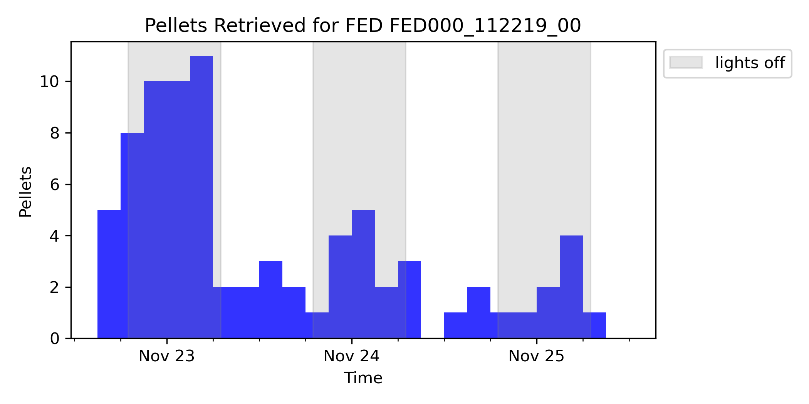

Highlighting a single 

The color of these plots can be set, also (**Settings > Individual Pellet Plots > Default color (single pellet plots**)).

### Multi Pellet Plot

*Can use night shading* :new_moon_with_face:

*Combines all highlighted files into a single plot* :bar_chart:

	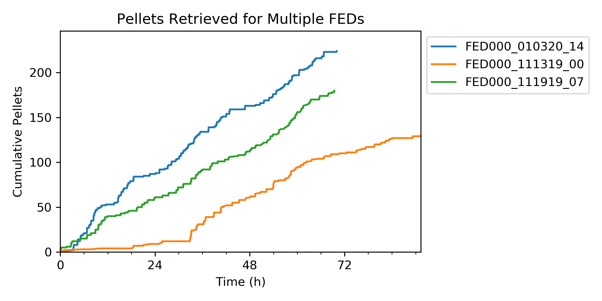

Multi Pellet Plots are basically Single Pellet Plots, but individual devices are plotted as separate lines.  As above, either the cumulative amount or binned frequency of pellet retrieval can be plotted.

The only additional setting is **Settings > Individual Pellet Plots > Align multi pellet plots to the same start time**.  When ticked (as above), pellets will be plotted against the *elapsed time* (since each device started); this prevents shading of dark periods.  When unticked (default), the *absolute date/time* will be preserved, so FEDs which were recorded at different times will not overlap.

### Average Pellet Plot

*Can use night shading* :new_moon_with_face:

*Uses groups* :paperclip:

*Uses averaging methods* 🧮

	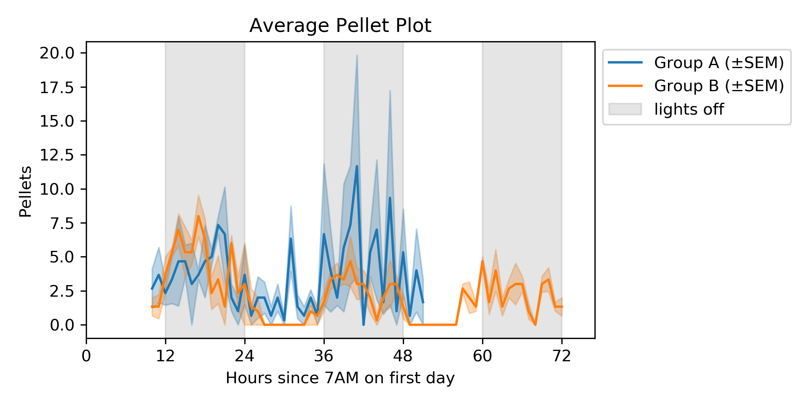

Average Pellet Plots average the pellets retrieved for each file in a Group.  Each group in the plot is plotted as a separate line.

### Interpellet Interval Plot

*Combines all highlighted files into a single plot* :bar_chart:

	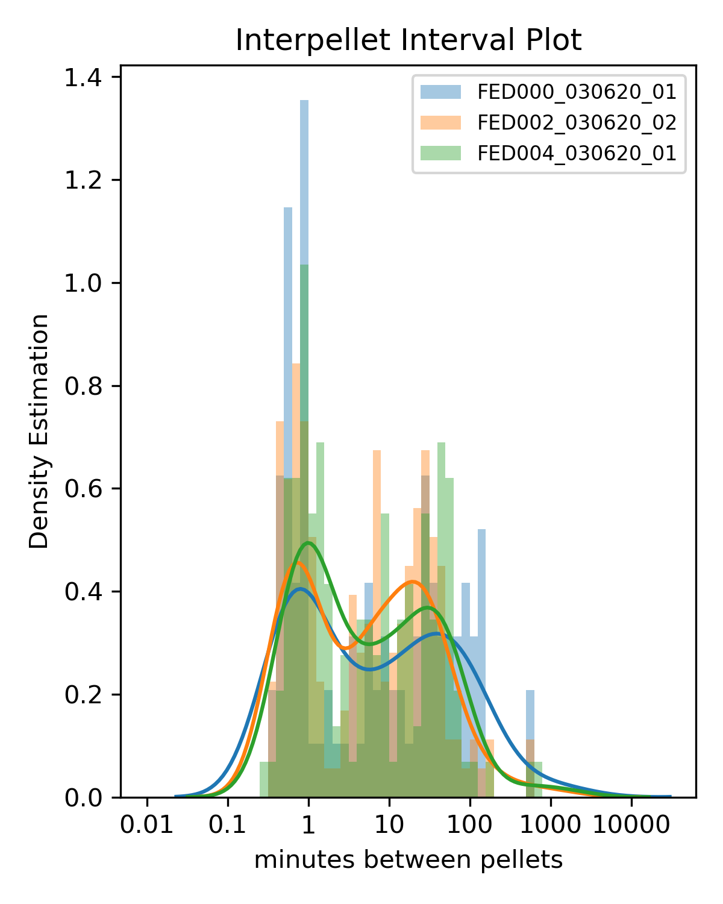

The Interpellet Interval Plot is a histogram where the values counted are the time between each pellet retrieval event.  This plot can give you a sense of how the mouse feeds or earns pellets, and it show changes in meal or eating frequencies.

This plot is a fairly unaltered use of [`seaborn.distplot`](https://seaborn.pydata.org/generated/seaborn.distplot.html).  The only option, **Settings > Interpellet Interval Plots > Use kernel density estimation** toggles the `kde` argument of this function:

- When ticked, a kernel density estimation (KDE) is used to model the probability density function of the interepellet intervals.  The density estimation is plotted on the y-axis: the area under the whole curve of the KDE is 1, and the area under a certain portion estimates the probability of observations occurring within that portion.
- When unticked, a raw histogram is parted, the KDE line is removed, and the y-axis represents counts in each bin.

Note that Interpellet Interval Plots use logarithmically spaced x-axes (in minutes).

### Group Interpellet Interval Plot

*Uses groups* :paperclip:

	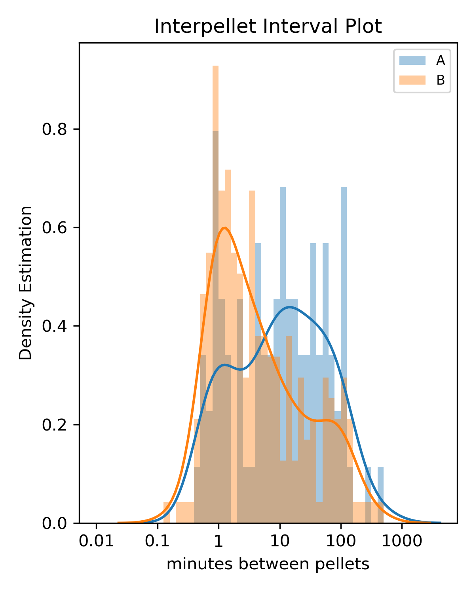

Same as the Interpellet Interval Plot (see above), except this version plots groups as separate curves.  The Interpellet Intervals from the files of every group are appended to one array, and then plotted.  The KDE line can also be turned on or off.

### Single Poke Plot

*Can use night shading* :new_moon_with_face:

*Creates one plot for each highlighted file* :bar_chart::bar_chart::bar_chart:

	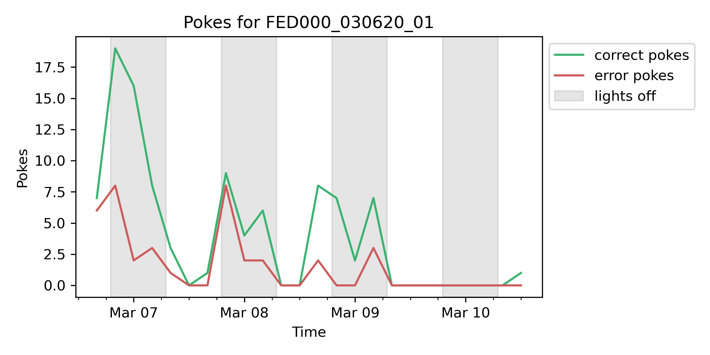

The Poke Plot shows the amount of pokes overtime for a single file.  The file is binned at a user-specified frequency, and the amount of pokes within each bin is plotted.  Settings for tweaking this plot are under **Settings > Individual Poke Plots**:

- **Values to plot**: How to represent the pokes plotted: **Cumulative** or **Frequency** (non-cumulative)
- **Bin size for poke plots**: The size of bins (only used then **Values to plot** is **Frequency**)
- **Show correct pokes**: Shows the amount of correct pokes when ticked
- **Show incorrect pokes**: Shows the amount of errors when ticked
- **Show left pokes**: Shows the amount of left pokes when ticked
- **Show right pokes**: Shows the amount of right pokes when ticked

Note that you can plot any combination of left/right/correct/incorrect pokes, but at least one must be selected to make the Create Plot Button active.

### Average Poke Plot

*Can use night shading* :new_moon_with_face:

*Uses groups* :paperclip:

*Uses averaging methods* 🧮

	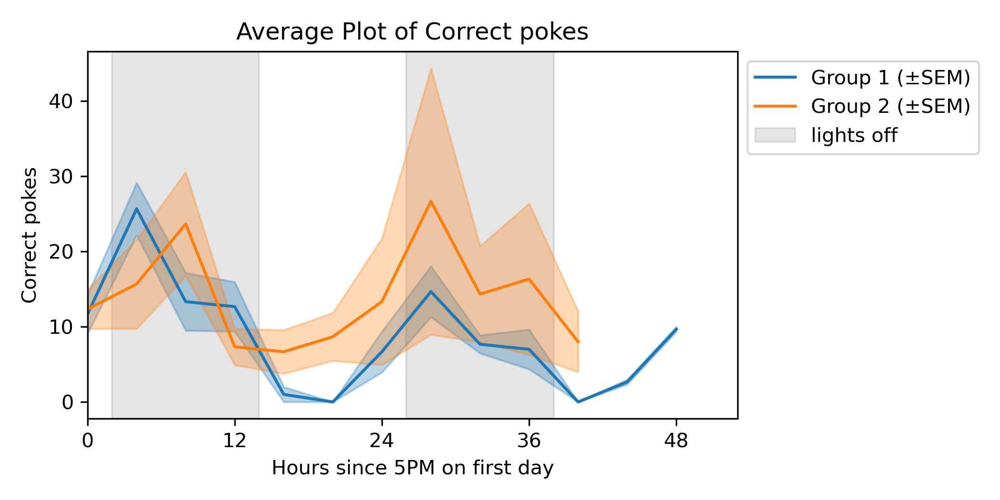

The Average Poke Plot creates a Group average of either correct, incorrect, left, or right pokes (depending on the selection from the Plot Selector).  The non-cumulative count of pokes per bin is plotted.

### Poke Bias Plot

*Can use night shading* :new_moon_with_face:

*Creates one plot for each highlighted file* :bar_chart::bar_chart::bar_chart:

	

The Poke Bias Plot visualizes the preference for one poke versus another over time.  The program bins the data (at a frequency set by **Settings > Individual Poke Plots > Bin size of poke plots**), and for each bin computes the percentage of one type of poke (out of the total number of pokes in that bin).  Either the bias towards the correct poke or the left poke (regardless of correctnesss) can be visualized (**Settings > Individual Poke Plots > Comparison for poke bias plots**).  By default, the program will use a red-white-blue color map to highlight the bias; it can be changed to a single solid color by unticking **Use dynamic color for bias plots***.

*Note that the dynamic coloring of the line plots is actually made by creating a scatter plot of thousands of points, rather than a true line plot (this is easier given options provided by `matplotlib`).  In some cases, the dots may be visible rather than a complete line; a work around for this would need to increase the density of points created in the source code (the `DENSITY` argument in the `poke_bias` function of `plots/plots.py`).

### Average Poke Bias Plot

*Can use night shading* :new_moon_with_face:

*Uses groups* :paperclip:

*Uses averaging methods* 🧮

	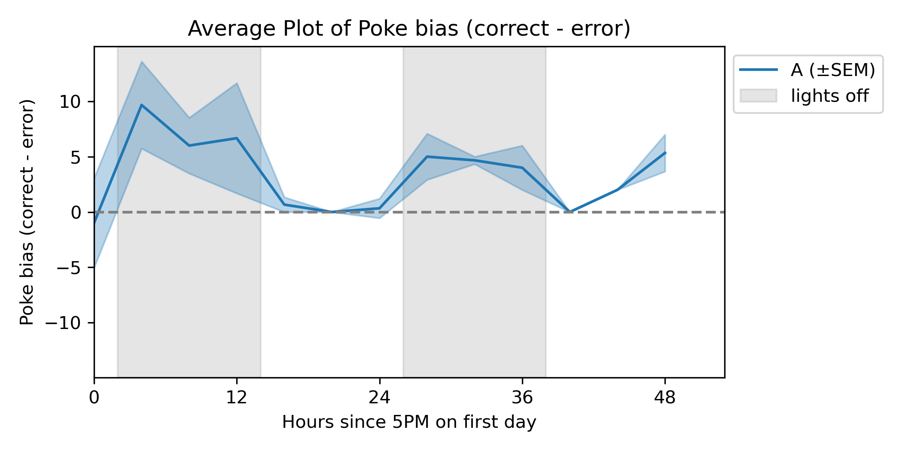

Average Poke Bias plots average the poke bias (see above) for Grouped devices.  Note that the dynamic coloring style cannot be used here.

### Breakpoint Plot

*Combines all highlighted files into a single plot* :bar_chart:

	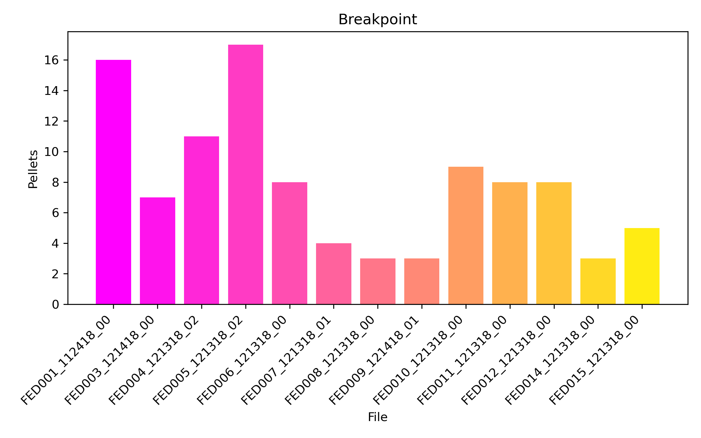

The Breakpoint Plot is a bar plot showing the "breakpoint" for multiple devices.  The breakpoint is the maximum value of pokes or pellets reached before a period of inactivity.  It is a concept primarily used in progressive ratio tasks to capture a point of loss of motivation.  While the Breakpoint Plots here are designed to be used with progressive ratio data, they can be made for any type of file.

Options for these plots are under **Settings > Progressive Ratio**:

- **Value to plot**: can be **pellets** or **pokes**, the latter being correct pokes
- **Break length (hours/minutes)**: threshold of inactivity to call the breakpoint; the "hours" and "minutes" are added

### Group Breakpoint Plot

*Uses groups* :paperclip:

	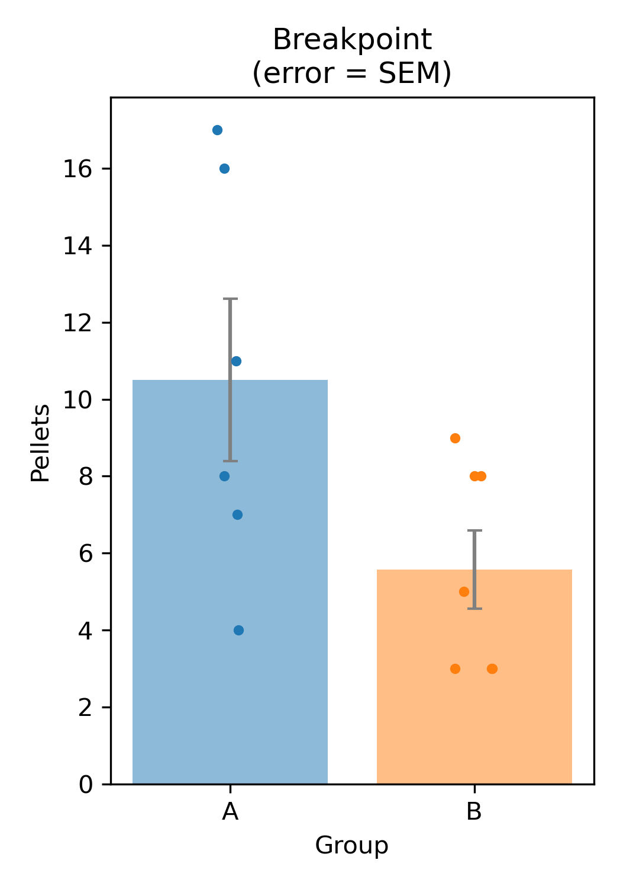

The Group Breakpoint Plot averages breakpoints (see Breakpoint Plot) for Grouped devices.  In addition to the other settings under **Settings > Progressive Ratio**, Group Breakpoint Plots can be tweaked with:

- **Error value for group breakpoint plots**: What values to use to create error bars; options are SEM (standard error of the mean), STD (standard deviation), or None.
- **Show individual values**: When ticked, values for individual recordings are superimposed over the bars to show the values contributing to the average.

### Chronograms (Line)

*Can use night shading* :new_moon_with_face:

*Uses groups* :paperclip:

	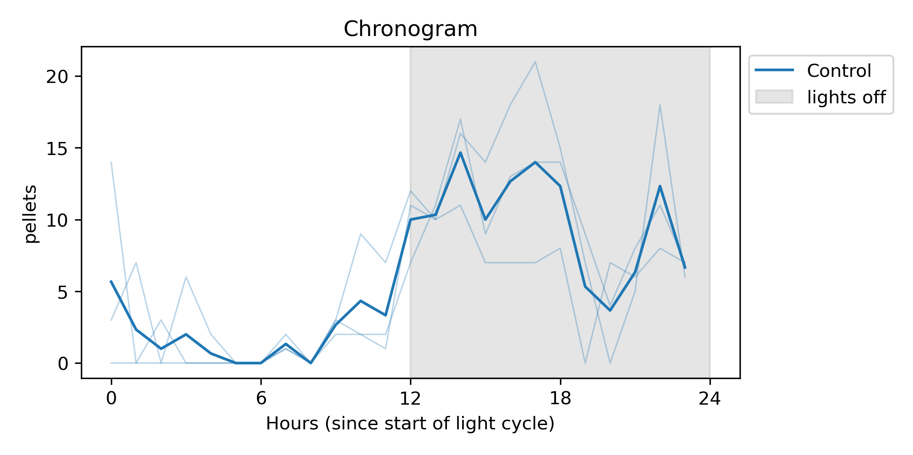

The "Chronogram" is one way of visualizing circadian activity in FED3 Viz.  The line plot shows the average 24-hour pattern of a variable for a Group of devices.  The data are resampled to hour-long bins, and matching hours across multiple days are averaged for each device to create 24 points (one for each hour of the day).  The individual files within each Group are then averaged and plotted.

There are a few settings which affect these plots, as well as the other Circadian Plots ([Chronogram (Heatmap)](#chronogram-heatmap) and [Day/Night](#daynight-plot)]):

- **Values to plot**: What values are being plotted on the y-axis.  Options are pellets, interpellet intervals, retrieval time (of pellets), correct pokes, and errors; the latter two can also be expressed as a percent.
- **Error value**: What values to use to create error bars; options are SEM (standard error of the mean), STD (standard deviation), or None.
- **Show individual FED data points**: When ticked, values for individual recordings are superimposed around the average line to show the values contributing to the average.  For Chronogram (Line) plots, ticking this will override the Error value.

These and other circadian plots all refer to the light/dark cycle, which is set under **Settings > General > Shade dark periods (lights on/lights off)**.

### Chronogram (Heatmap)

*Combines all highlighted files into a single plot* :bar_chart:

	

The Heatmap version of the Chronogram is simply a different representation of the data from the Chonogram (Line) Plot (see above).  Rather than an average line, each file is shown as a row in a heatmap, where the colors correspond to the selected variable value over the averaged 24-hour period.

Note that this plot type does not use Groups; it plots what is selected in the File View, and provides an average of them in the final row of the heatmap.

### Day/Night Plot

*Uses groups* :paperclip:

	

Day/Night Plots show average values for Groups of data during daytime and nighttime.  What is consider day or night is set by the times selected in **Settings > General > Shade dark periods (lights on/off)**.  Regardless of the value plotted, the bars represent the *Group average of the daily or nightly average values of each file*.  That is, for each file, the program averages the selected value for all its day or night periods; those values represent the individual FED data points, and they are averaged to create the value for the bar.  Note that both individual values and error bars can be shown for these plots.

### Diagnostic Plot

*Can use night shading* :new_moon_with_face:

*Creates one plot for each highlighted file* :bar_chart::bar_chart::bar_chart:

	

The Diagnostic Plot is used to help identify problems with the FED over the course of its recording.  It is a 3 panel plot, which shows the pellets retrieved, motor turns, and battery life over time.

The motor should only need to turn a few times (under 10) for each pellet dispensed.  Slightly higher values than this (10-50) may represent the FED's mechanism to try and unjam, while much higher values (>100) may represent a longer pellet jam.

 

# Managing Plots

When a plot is created using a button on the Home Tab, the Plots Tab will be raised and the newest plot will be shown in the Display Pane.  All active plots will be shown in the Plot List, and clicking the name of the plot will render it in the Display Pane.  

The Plots Tab has additional buttons which allow you to manage and save your plots; there are also some additional features which allow for editing of the plot after creation.

### Renaming Plots:

To rename a plot, select a **single** plot from the Plot List, and click the **Rename Button**.  In the text entry box that pops up, enter a new name for the plot and click OK.  Plot names must be unique.

### New Window:

To show plots in a new window, select one or more graphs from the Plot List and click the  **New Window Button**.  This feature allows for viewing of multiple graphs simultaneously.

### Navigation Toolbar:

	

FED3 Viz includes a `matplotlib` interactive toolbar for editing rendered plots.  This can be used to limit the axes, zoom in on a certain region of the graph, or alter the aspect ratio.  Specific guidance on how to use this tool can be found [here](https://matplotlib.org/3.1.1/users/navigation_toolbar.html), but note that the keyboard shortcuts will not work.

### Saving Plots

There are three main aspects of plots which can be saved in FED3 Viz: images, data, and code.

Note that by default, FED3 Viz will not overwrite images or data saved with conflicting names.  This can be changed by checking **Settings > General > Overwrite plots & data with the same name when saving**.

##### Saving Images

To save plots, highlight one or more plots from the Plot List and click the **Save Plots Button**.  This will bring up a file dialogue, and prompt the user to select a folder to save the images in.   Plots are saved in `.png` format at 300 DPI.  The name of the file will be the same as the plot's name in the Plot List.  Note that the Navigation Toolbar also has a button that can save plots, but using it (in this case) will limit the DPI (to 125 or 150, depending on the plot).

##### Saving Code

	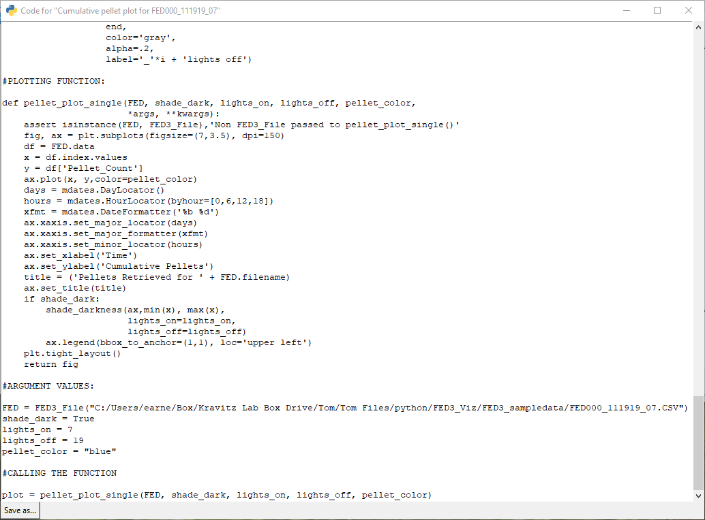

FED3 Viz can return the code used to create each plot through the **Plot Code Button**.  The aim of this feature is to allow users to be able to tweak graphs (with Python) in ways not possible in FED3 Viz. 

Each plot type in FED3 Viz is associated with one or more plotting functions defined in Python; settings from the Settings Tab translate into arguments passed to these functions.  The Plot Code Button uses Python's `inspect` library to return the source code of these plotting functions.  The program formats this code with additional lines that are specific to each plot, like the data source and the settings used.

**The Plot Code output should be a functional script**; that is, running the script in a separate Python session should recreate the plot (given the appropriate packages and package versions in that environment).  To achieve this, the output script has to include the following:

- a list of packages to import
- the definition of a class used to load FED3 data and do some preprocessing
- definitions of helper functions used by the plotting function
- definition of the plotting function
- assignment of the specific arguments used by the function for the plot
- a line calling the function

All this makes the code somewhat verbose, but it aims to make the script run-able without modification.

Plot Code is displayed in a new window, and can be saved as a `.py` or `.txt` file using the Save As... Button at the bottom of the window.

**Saving Data**

Clicking the **Save Plot Data Button** will export one or more `.csv` files which contain the values plotted; the format depends on the type of graph.  These files can be used to recreate graphs or run statistics in separate software.  Clicking the Save Plot Data Button will bring up a file dialogue, and will ask the user to select a location for saving the output.

### Deleting Plots

To delete plots, highlight one or more plots from the Plot List and hit the **Delete Button**.

 

# Settings

Most of the settings available on the Settings Tab pertain to plots and were described above.  There are a couple additional aspects of the Settings menu which will be described here.

### Saving Settings

FED3 Viz can save settings and load settings in case of specific user preferences.  Settings files are saved in `.csv` format, and they preserve the state of all settings in the Settings Tab.  There is a default **Settings Folder** for saving settings, which depends on the installation method:

- **Windows or Mac Executable:** `fed3viz/settings/`
- **Python Script** (i.e. GitHub source code): `FED3_Viz/FED3_Viz/settings/`

To save the current settings, click the **Save Button** under **Settings > Save/Load Settings.**  This will prompt you to provide a name for the settings file.

Settings can later be loaded by using the **Load Button** under **Settings > Save/Load Settings**.  This will default to looking in the Settings Folder.

### Default Settings

The Settings Folder comes with a `DEFAULT.CSV` file, and the program attempts to load this every time it starts up.  You can overwrite this file, or save any other settings as `DEFAULT.CSV` in order to load them automatically at startup.  If this file cannot be found or is improperly formatted in anyway, it will not be loaded and the application will fall back to some built-in default settings.

### Last Used Settings

There is also an option to remember the settings used the last time the application was closed.  Every time the program closes, it writes a `LAST_USED.CSV` file into the Settings Folder, containing the state of settings at that time.  If you have checked **Settings > Save/Load Settings > Load last used settings when opening**, these settings will be loaded.  

 

# FAQ

This section will mainly cover troubleshooting and issues; please also check the manual for discussion of specific functions and features.

- **I downloaded the executable but it won't run.**   Unfortunately, I am fairly unaware of the exact system requirements for FED3 Viz (it was built with `PyInstaller`, which is largely a black box to me).  If on Windows, one thing you can try is running the `.exe` from the command line (`cd` into the directory and then enter `fed3viz.exe`).  This will leave the console open and may provide an error message which can be shared.  On Mac, the Terminal can similarly be inspected.  

  If the error persists, I would instead recommend trying to run FED3 Viz from the Python script (Method 2 of the Installation instructions).  This is more likely to be troubleshooted successfully.
  
- **The program slows down, doesn't respond, or crashes.**  In previous iterations of the code, I experienced slowdown when many FED files were loaded in one go (especially with long files) or when a plot was created with many devices shown as separate curves.  In my experience, the program recovered and finished the loading/plotting after a few seconds.  To avoid these issues, I had to select fewer (10 or less) devices when loading (i.e. per push of the Load Button) or plotting devices.  However, changes since then have cleared up some of these issues (on my end; the program now "checks in" in between each device load or plot creation).  If the problems on your device result in frequent crashes or persistent slow downs, even when using small amounts of data, please report this.  I have taken a relatively minimal approach to optimizing speed, and there may be ways to improve.

- **I can't load some of my FED data, or I can load but some plots don't work**.  The most likely cause is that you have a previous version of FED output data, or that there have been edits to raw data.  FED3 Viz tries to handle old formats of the data, but there may be cases which cannot be handled.  Some examples of current data are included on GitHub in the `example_data` folder.  You can compare your data to these to see if there might be any obvious differences; you can also test that the example data load correctly.  Please share any specific issues on GitHub.

- **I do have differently formatted data; how can I know which plots work?**  If the discrepancy is that your data files are missing some columns (because of editing or previous file formats), the best bet is to check the [Appendix](#appendix) and look at the plot column dependencies - these are literally the columns that the program interacts with in order to make the plot.  If the issue is that there are changed values (i.e. not written by FED3) in the data, the results are more unpredictable.  Additionally, there are some specific notes about pokes in older file formats provided in the Appendix.

- **One of the plots I made looks weird.**  By "looks weird" I mean things like broken lines, empty areas of the plot, lines during off periods, smooshed axes text, or completely empty plots.  "Issues" like this may occur given some specific cases of data; I put issues in quotes because some peculiarities may actually accurately reflect the data (say if they have missing values or are temporally distant from each other).  Hopefully, this manual can give you an intuition of the processing that goes into creating a specific plot.

  On the other hand, if "looks weird" means you think the plot isn't actually representing the data, or the plot doesn't match one you have created, this could reflect a code error, or an unclear description of what the plots are doing.  Regardless of what "looks weird" means, I would be happy discuss and sort out any specific cases.

- **Why do plots of left/right pokes look different from correct/error?**  There are a few reasons that could cause this:

  - The recording mode is one where the "Active Poke" poke changes sides (in which case the behavior is expected)
  - There was an error during logging - I have stumbled across a few cases where a pellet retrieval gets logged as a poke, which can affect the assignment of correct/incorrect.  These are (in my experience) rare and should only cause minute differences.
  - You are using an old file format for which correct/incorrect fails to be assigned (see the discussion of old file formats in the Appendix).  In this case, you will have to plot left/right rather than correct/incorrect (and perhaps retitle the plot later).
  - You have encountered a peculiar case (please report this!).  The plotting of correct/incorrect and left/right rely on different methods of calculation (in order for L/R to be more friendly to older file formats, see point above).  For new file formats, this should give the same answer (when one poke is always active).   But there is a chance the output could differ in certain scenarios - I will correct this if so.

- **I'm seeing console errors & warning when starting up or running the program.**  Some of these are to be expected, and you shouldn't worry about them if the program continues to work as expected.  If there are functional issues, please report these errors.

- **On Mac, I don't get the option to select some files when loading.**  This is a bug right now; try to change the file types searched for from "All" to another option, and then back to "All".

- **I'm encountering issues when using files with the same name**.  Please report these; there could be some errors with duplicate files or files with exactly matching names which need to be resolved.  The easiest workaround before a fix is to rename files (outside of FED3 Viz) to be unique. 

- **Will there be more plots/features added?**  Yes!  FED3 Viz will likely be worked on through Summer 2020.  There are more features in the works, particularly in regards to the operant functions of FED3 Viz.  Please share any suggestions for development on GitHub or the FED3 Google Group.

- **I saved the Python code for a plot and it doesn't run.**  This could be due to many issues, but some possible causes are:
  
  - You are not using Python 3
  - You do not have the necessary packages installed, or their versions are incompatible with FED3 Viz.  The packages used by FED3 Viz are documented in the `requirements.txt` file on GitHub
  - Your IDE is not showing the plot (sometimes an issue with how inline plotting is handled; sometimes this causes plots not to show on the first run)
  - There is an error in the output plot script, which is certainly possible!  The most likely issues are that some of the necessary helper functions were not included or the arguments are improperly formatted.  Please report these errors on GitHub with the specific context, both to help solve your specific case and to improve the application.
  
- **I have suggestions for improving the plot code I saved.**  You may rightfully wonder why the code to make a simple line plot ends up being 400 lines!  Please note that FED3 Viz's plotting functions are designed to handle different settings on the fly, and the code to make one specific plot may be writable in a much less verbose way.  Some pieces of the code may be helpful for the application, but irrelevant to your specific plot.

  That being said, I would enjoy discussing (on GitHub) and possibly including any proposed changes which significantly contribute to the readable or speed of the code.  Aside from that, sharing code may be useful for other users.

- __What are the `**kwargs` doing in plot function definitions? __  [These are "star keyword arguments"](https://realpython.com/python-kwargs-and-args/).  In general, they allow Python functions to accept a variable number of arguments.  Every time FED3 Viz creates a plot, it gets the current state of *all* settings and converts them into a dictionary of arguments (where the key is an argument name and the value is an argument value, like a number or a string); these arguments are passed to the selected plotting function.  Arguments that aren't explicitly named in that function definition will be passed as  `**kwargs`; they do not get used but they also do not produce an error.  This system allows FED3 Viz settings to easily affect multiple plotting functions, and saves some verbosity in the GUI code.  *Basically, `**kwargs` are needed in the context of the application, but they are unnecessary (and can be deleted) in the returned Plot Code*.  In general, it's confusing and redundant to include `**kwargs` (or `*args`) if they are not being used (hence), but this is a peculiar case.  

- **I can't load some settings, or my settings look weird.**  This could be an issue with altered setting files, or settings files with which have entries that don't match the application.  Please redownload the `DEFAULT.CSV` and `LAST_USED.CSV` files from GitHub and replace them in your FED3 Viz folder.  Alternatively, try to save new settings from the application to overwrite the `DEFAULT.CSV` file.

- **I have an issue that I have shared and I haven't heard back from anyone.**  Please be aware that FEDs are being worked on by a small group of researchers, and FED3 Viz is only really maintained by me :cold_sweat:.  We will do our best to respond prudently to questions shared online, but bear with us!

 

# Appendix

### FED3 Arduino Versions

The FED3 Arduino code is open source, and it's often being updated to meet new requirements by FED3 Users.  **This software is designed to work with the current (time of writing) version of standard Arduino scripts (i.e. those posted on the FED3 Hackaday) used by FED3**.  We will attempt to marry the development of FED3 with the development of this software, such that files will continue to be recognized and plots give expected results.  While many small tweaks to the data logging code may not causes issues with this software, changes that may affect FED3 Viz are things like the addition or removal of columns written by FED3, or changes to how pellets, pokes, or timestamps are logged.  If you have a new version of FED code that doesn't work with FED3 Viz, please report the issue!

###### Specific note on poke logging in older versions: 

A major change in the development of FED3 code was altering how often data was written, and for what events.  Currently, FED3 will timestamp and log a row when there is a poke (both active and inactive) or a pellet retrieval.  Previously, FED3 would only log a row whenever a pellet was retrieved.  Thus, the current version logs more information, and gives the precise time when all pokes occur.

FED3 Viz is written to work with this newer style of data logging.  It will assign each poke as "Correct" or "Incorrect" based on which poke was labeled as active (i.e. `Active_Poke`) at the time of logging.   **Because the older format does not log individual pokes, nor which poke is active for each poke, pokes are not labeled as correct or incorrect**; the rationale for this decision is based on newer recording modes during which the active poke can switch between left and right.  Therefore, this old format will likely not work with plots about correct/incorrect pokes.  

Instead, plots based on left or right pokes may achieve a similar purpose for these older file formats (if one poke is always active).  These plots only rely on detecting the cumulative poke change in the `Left_Poke_Count` and `Right_Poke_Count` columns, regardless of file format.  However, note that coarser grain of data in the old file format can still cause issues: in the case that there is period of time with only inactive pokes, these will only be logged on the next active poke.  Hence, when making inactive pokes that bin data over time, inactive pokes may be placed in the wrong bin (but as the bin size increases these occurrences should become less likely).

All-in-all, when using the old file format (or any custom version of FED3 software), be aware there may be issues!

 

### Averaging Methods Diagram

See in higher resolution at `FED3_Viz/img/manual/average_illustration.png`.

	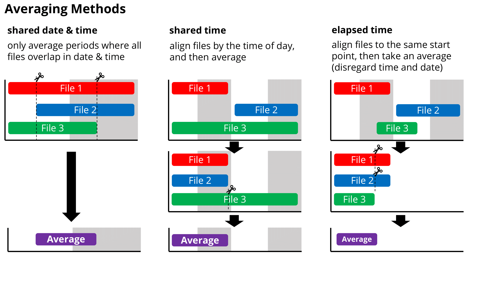

 

### Plot Column Dependencies

This table shows which columns of a FED3 data file are used by FED3 Viz to create each plot.  If a file is missing a column, or contains changes in a column, associated plots may not be able to be created.

| **Plot**                     | **MM:DD:YYYY hh:mm:ss** | **Pellet_Count**   | **Left_Poke_Count** | **Right_Poke_Count** | **Active_Poke**    | Retrieval_Time     | **Battery_Voltage** | **Motor_Turns**    |
| ---------------------------- | ----------------------- | ------------------ | ------------------- | -------------------- | ------------------ | ------------------ | ------------------- | ------------------ |
| Single Pellet Plot           | :heavy_check_mark:      | :heavy_check_mark: |                     |                      |                    |                    |                     |                    |
| Multi Pellet Plot            | :heavy_check_mark:      | :heavy_check_mark: |                     |                      |                    |                    |                     |                    |
| Average Pellet Plot          | :heavy_check_mark:      | :heavy_check_mark: |                     |                      |                    |                    |                     |                    |
| Inter Pellet  Interval Plots | :heavy_check_mark:      | :heavy_check_mark: |                     |                      |                    |                    |                     |                    |
| Single Poke Plot             | :heavy_check_mark:      |                    | :heavy_check_mark:  | :heavy_check_mark:   | :heavy_check_mark: |                    |                     |                    |
| Average Poke Plot            | :heavy_check_mark:      |                    | :heavy_check_mark:  | :heavy_check_mark:   | :heavy_check_mark: |                    |                     |                    |
| Poke Bias Plot               | :heavy_check_mark:      |                    | :heavy_check_mark:  | :heavy_check_mark:   | :heavy_check_mark: |                    |                     |                    |
| Average Poke Bias Plot       | :heavy_check_mark:      |                    | :heavy_check_mark:  | :heavy_check_mark:   | :heavy_check_mark: |                    |                     |                    |
| Circadian (Pellets or IPI)   | :heavy_check_mark:      | :heavy_check_mark: |                     |                      |                    |                    |                     |                    |
| Circadian (Pokes)            | :heavy_check_mark:      |                    | :heavy_check_mark:  | :heavy_check_mark:   | :heavy_check_mark: |                    |                     |                    |
| Circadian (Retrieval Time)   | :heavy_check_mark:      |                    |                     |                      |                    | :heavy_check_mark: |                     |                    |
| Diagnostic Plot              | :heavy_check_mark:      | :heavy_check_mark: |                     |                      |                    |                    | :heavy_check_mark:  | :heavy_check_mark: |

