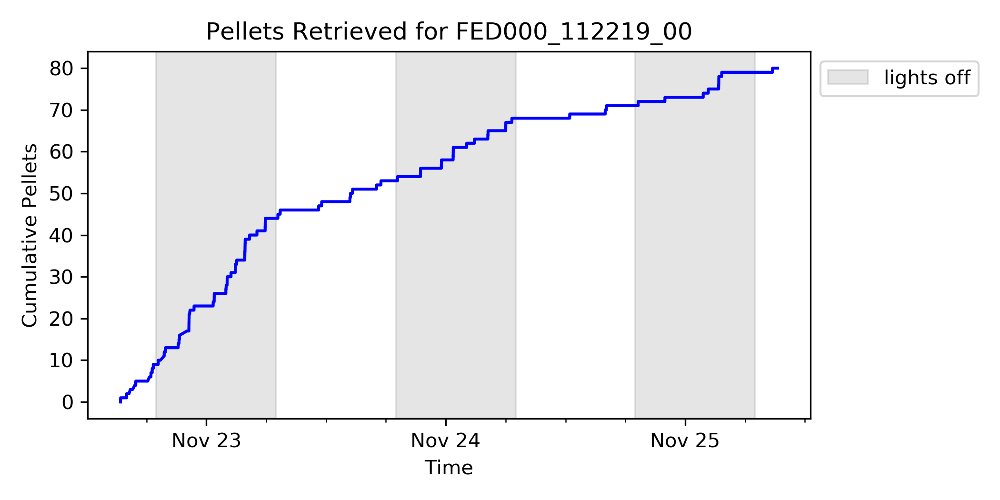
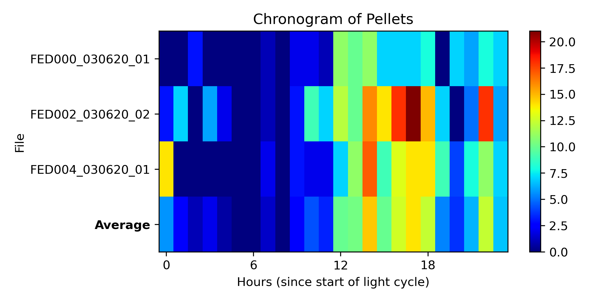
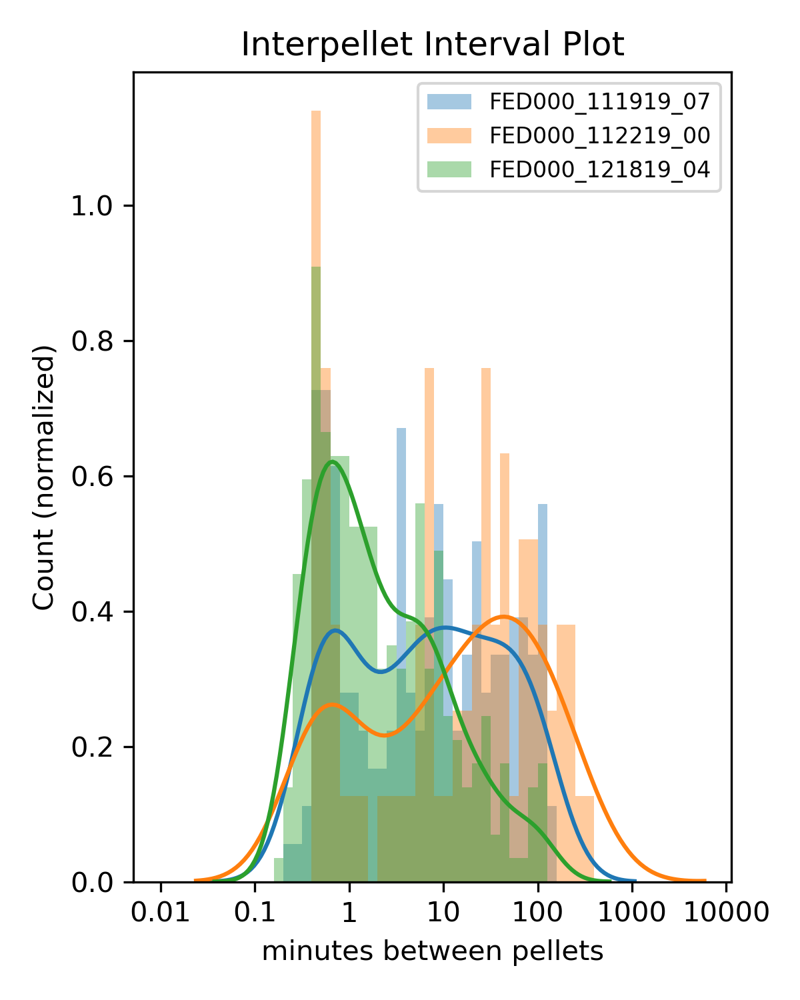
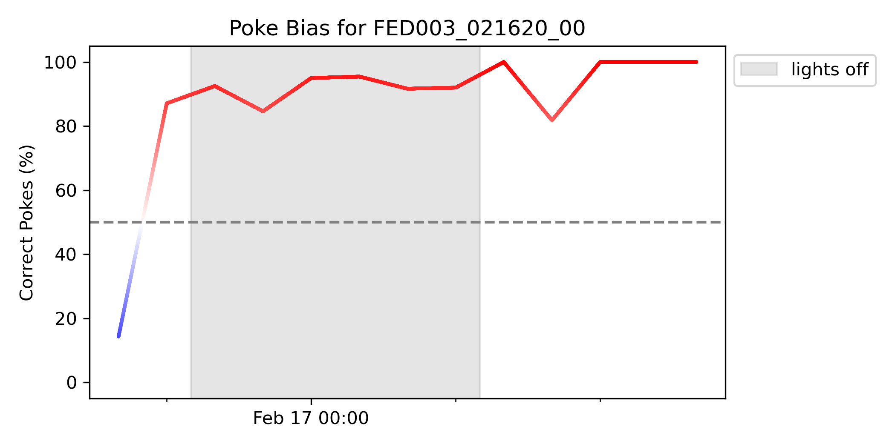

# FED3 Viz (Beta)
a GUI for plotting FED3 data

	

## Table of Contents
- [What is FED3?](#what-is-fed3)
- [What is FED3 Viz?](#what-is-fed3-viz)
- [Current Features](#current-features)
- [Gallery](#gallery)
- [Installation](#installation)
- [Beta Statement](#beta-statement)

## What is FED3?

FED3 is the [3rd version of the Feeding Experimentation Device](https://hackaday.io/project/106885-feeding-experimentation-device-3-fed3), an open-source, home-cage feeding device for mouse operant behavioral tasks.  FED3 was developed in the [Kravitz Lab](https://kravitzlab.com/) in order to run high-throughput, inexpensive experiments on reward and learning.

    

## What is FED3 Viz?

**FED3 Viz** is software for graphing data produced from FED3 devices.  FED3 Viz is written in Python using the `tkinter` library.  FED3 Viz is meant to create a quick & easy method for visualizing FED3 data without having to edit the raw data.

    

## Current Features

- Various graphs to visualize:
  - pellet retrieval
  - correct and incorrect pokes
  - intervals between pellet retrieval
  - pellet retrieval time
  - meal sizes     ***New feature!***
  - progressive ratio breakpoints
  - circadian patterns of activity
  - grouped averages for multiple devices
  - motor turns & battery life
- Toolbar for live plot editing (from [`matplotlib`](https://matplotlib.org/3.1.1/users/navigation_toolbar.html))
- Savable code and data for each plot
- Sortable viewer showing recording properties
- Summary statistics      ***New feature!***
- Group labels for averaging data
- Savable settings
- Savable "Sessions" (for reloading files, plots, and settings)
- Use date cutoffs to filter data plotted     ***New feature!***
- Concatenate data (from single recordings split over multiple files)     ***New feature!***

See the Releases tab for specific notes about new each version.

## Gallery

  FED3 Viz uses primarily `matplotlib` and `seaborn` for visualizations.
  

      
  

  

      
  

  

      
  

  

      
  
  
  

      
  

## Installation

FED3 Viz can either be run from a packaged application file, or from a Python interpreter.  Specific instructions for installation and system requirements can be found [here](https://github.com/earnestt1234/FED3_Viz/blob/master/Installation.md).

There is a manual for FED3 Viz which covers the use of the program once it is installed; it can be found [here](https://github.com/earnestt1234/FED3_Viz/blob/master/Manual.md), or [here as a pdf](https://github.com/earnestt1234/FED3_Viz/blob/master/pdfs/Manual.pdf).

## Beta Statement

**This program is currently in "beta"**: it has only been tested by a few individuals on their machines, with a small selection of data files.  Additionally, the program is still being actively worked on, and likely will be through summer 2020.  I am eager to have other people try the application and report bugs, preferably [through GitHub](https://github.com/earnestt1234/FED3_Viz/issues) or the [FED3 Google Group](https://groups.google.com/forum/#!forum/fedforum).  

Moreover, we will certainly consider and try to meet any requests for additional features/graphs! I greatly appreciate the [input so far, some of which have been added to FED3 Viz](https://groups.google.com/forum/#!topic/fedforum/YhF0pzMGD9c), and would love more.

Things that would be great to get feedback on:
 - If you encounter any issue while using the program, like crashes or errors
 - Any confusing/unexpected behavior (whether my intention or not)
 - Any additional features you feel it is lacking
 - Little issues with the interface (like window size, buttons being grayed out, selection highlighting)
